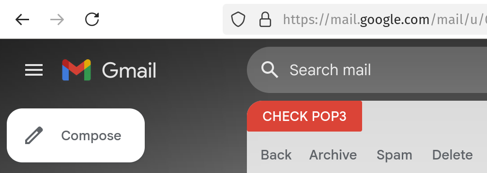

# Gmail POP3 Quick Check

Gmail POP3 Quick Check is a browser extension script that adds a convenient button to Gmail's interface for checking POP3 accounts instantly. Instead of navigating through settings menus, users can check their POP3 mail with a single click directly from Gmail's main interface.

## Features

The script enhances Gmail's functionality by providing:

- A "Check POP3" button integrated seamlessly into Gmail's toolbar
- Single-click POP3 mail checking for all configured accounts
- Automatic return to inbox after checking mail
- Visual feedback during the checking process
- Support for multiple POP3 accounts
- Compatible with both light and dark Gmail themes

## Installation

### Prerequisites

Before installing the script, ensure you have one of these browser extensions installed:

- Firefox: [Greasemonkey](https://addons.mozilla.org/en-US/firefox/addon/greasemonkey/)
- Chrome: [Tampermonkey](https://chrome.google.com/webstore/detail/tampermonkey/dhdgffkkebhmkfjojejmpbldmpobfkfo)
- Edge: [Tampermonkey](https://microsoftedge.microsoft.com/addons/detail/tampermonkey/iikmkjmpaadaobahmlepeloendndfphd)

### Installing the Script

1. Install Greasemonkey/Tampermonkey if you haven't already
2. Click on this link to install the script: [Install Gmail POP3 Quick Check](../../raw/main/gmail-pop3-quick-check.user.js)
3. When prompted by your userscript manager, click "Install"
4. Refresh Gmail if it's already open

## Usage

After installation, using the script is straightforward:

1. Open Gmail in your browser
2. Look for the "Check POP3" button in Gmail's toolbar (next to the settings gear icon)
3. Click the button to check all configured POP3 accounts
4. Wait a few seconds while the check completes
5. The page will automatically return to your inbox

## Troubleshooting

Common issues and their solutions:

1. Button not appearing:
   - Refresh Gmail completely (F5 or Ctrl+R)
   - Ensure the script is enabled in Greasemonkey/Tampermonkey
   - Check the browser console (F12) for any error messages

2. Button appears but doesn't work:
   - Verify you have POP3 accounts configured in Gmail
   - Check if you can manually check POP3 through Gmail settings
   - Clear browser cache and reload Gmail

3. Script conflicts:
   - Temporarily disable other Gmail-related userscripts
   - Check if the issue persists in a private/incognito window

## Support and Contributing

If you encounter issues or want to contribute to the development:

1. Check the [Issues](../../issues) page for known problems
2. Open a new issue if you find a bug
3. Submit pull requests for improvements
4. Contact the maintainer through GitHub

## Privacy and Security

This script:
- Does not collect any user data
- Works entirely within your browser
- Doesn't require any external services
- Uses only Gmail's existing functionality

## Version History

- v1.3 (2025-01-14)
  - Added automatic return to inbox
  - Improved button placement reliability
  - Enhanced error handling
- v1.2 (2025-01-13)
  - Fixed compatibility with recent Gmail updates
  - Added visual feedback during mail check
- v1.1 (2025-01-12)
  - Improved multiple POP3 account support
  - Added error logging
- v1.0 (2025-01-11)
  - Initial release

## License

This project is licensed under the MIT License - see the [LICENSE](LICENSE) file for details.

## Acknowledgments

- Thanks to the Greasemonkey/Tampermonkey teams for making userscripts possible
- Thanks to the Gmail team for maintaining the web interface
- Special thanks to all contributors and users who provided feedback
